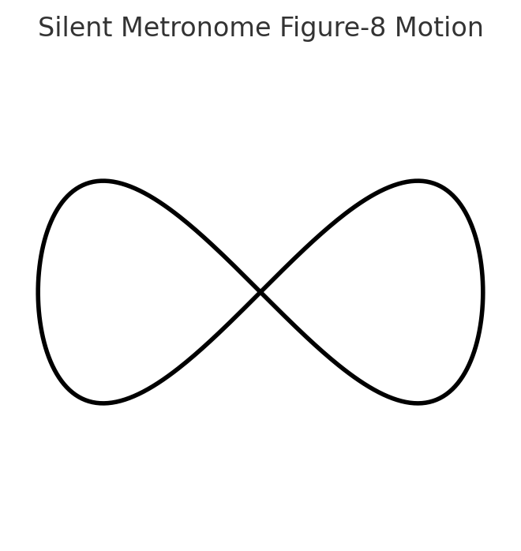

## Case Study: Silent Metronome Method for Voice Recording Consistency

**Challenge**  
While recording narration and voiceover work, I noticed my pacing would drift between takes. Using a traditional metronome helped, but the audible clicks or visible flashes distracted me and made it harder to focus on delivery.  

**Approach**  
I experimented with tempo and found that 110 beats per minute created a calm, deliberate delivery just under average conversational pace. Instead of relying on an audible cue, I created a physical rhythm by tracing a small **figure-8 pattern** with my right fist.  
- The loop provides both a **tactile beat** and **positional cues** for word starts and stops.  
- Some tempos align naturally with the top and bottom peaks of the “8,” others with the cross-over points.  
- The motion is completely silent, letting my microphone capture only the voice.  

**Result**  
This *Silent Metronome Method* gave me consistent tempo and tone across multiple sessions, with less mental effort than counting beats or following an audible click. It also freed my attention to focus on meaning, emotion, and vocal quality while my body kept time in the background.  

**Takeaway**  
By combining physical motion with rhythmic muscle memory, I eliminated an external distraction and built a repeatable process for delivering steady, professional-sounding voice work.  
